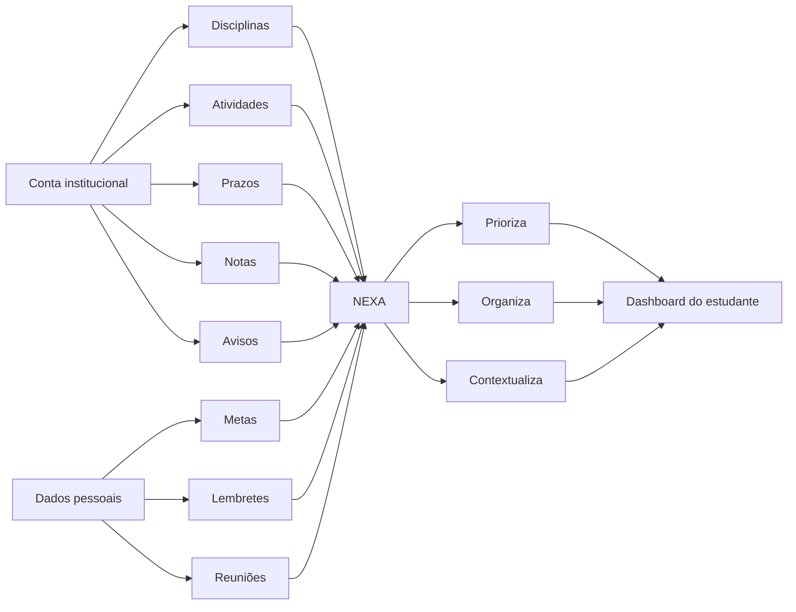

<p align="center">
  
</p>
<h1 align="center">NEXA | Experiência Acadêmica</h1>

<p align="center">
  <strong>Uma experiência acadêmica orientada por clareza, prioridade e acessibilidade.</strong>
</p>

<p align="center">
  <a href="https://www.figma.com/design/p4DvUhAbm4Ti6EUbLVtqpp/NEXA-%E2%80%94-Case-Study-Portfolio">
    Ver Case Study no Figma
  </a>
  ·
  <a href="https://github.com/codermila/NexaExperienciaAcademica">
    Ver repositório
  </a>
</p>

---

## Sobre o projeto

O **NEXA** é um projeto conceitual de **Product Design e UX/UI** criado para explorar como estudantes podem acompanhar sua rotina acadêmica de forma mais clara e objetiva.

Em vez de apresentar disciplinas, atividades, avisos, notas e prazos como informações isoladas, o produto reorganiza esses dados a partir do contexto do estudante e responde primeiro à pergunta:

> **O que precisa da minha atenção agora?**

A proposta é funcionar como um **companion app acadêmico conectado ao ambiente institucional**, oferecendo uma visão centralizada do que precisa ser feito, quando e com qual prioridade.

---

## Visão geral

| Item | Descrição |
|---|---|
| **Projeto** | NEXA | Experiência Acadêmica |
| **Tipo** | Projeto conceitual de Product Design / UX/UI |
| **Produto** | Companion app acadêmico |
| **Plataforma** | Mobile-first, com expansão prevista para desktop |
| **Papel** | UX/UI Designer · Product Designer |
| **Ferramenta principal** | Figma |
| **Foco** | Clareza, prioridade, acessibilidade e organização acadêmica |
| **Status** | Case Study de portfólio |

---

## O problema

A rotina acadêmica pode exigir que o estudante consulte diferentes disciplinas, calendários, avisos, atividades e ferramentas antes de entender o que realmente precisa fazer.

O desafio não é necessariamente a falta de informação.

É o **excesso de informações competindo pela atenção do usuário**.

Perguntas simples podem exigir vários passos:

- O que tenho para entregar hoje?
- Qual atividade vence primeiro?
- Onde parei nessa disciplina?
- O que tenho nesta semana?
- Estou em dia com meu progresso?
- Existe algum aviso importante?

Essa fragmentação aumenta o esforço necessário para **encontrar, interpretar e priorizar** informações acadêmicas.

---

## Objetivo

O NEXA foi pensado para permitir que o estudante responda rapidamente:

### O que fazer → Quando fazer → O que priorizar

Os principais objetivos são:

- reduzir a sobrecarga informacional;
- destacar atividades que exigem ação;
- centralizar prazos e compromissos;
- facilitar a continuidade dos estudos;
- apresentar progresso dentro do contexto de cada disciplina;
- criar uma navegação previsível;
- incorporar acessibilidade desde a estrutura da interface.

---

## How Might We

> **Como podemos reduzir o esforço necessário para que estudantes identifiquem tarefas, prioridades e prazos?**

A partir dessa pergunta, quatro princípios passaram a orientar o produto:

| Princípio | Direção |
|---|---|
| **Clareza** | Reduzir ruído visual e informacional |
| **Prioridade** | Destacar o que exige ação |
| **Previsibilidade** | Mostrar o que vem depois |
| **Acessibilidade** | Garantir compreensão e operação para diferentes perfis |

---

## Modelo do produto

O NEXA foi concebido para utilizar a **conta institucional do estudante** como principal fonte de informações acadêmicas.

Assim, o aluno não precisaria cadastrar manualmente todas as disciplinas, prazos ou atividades já existentes no ambiente institucional.



### Dados institucionais

- disciplinas;
- atividades;
- datas;
- notas;
- progresso;
- avisos.

### Dados pessoais

- lembretes;
- metas;
- compromissos;
- reuniões;
- anotações de organização pessoal.

> A integração institucional faz parte da **hipótese de produto** deste projeto conceitual.

---

## Principal decisão de UX

# Designing around “Today”

Uma das decisões mais importantes foi **não iniciar a experiência pela lista de disciplinas**.

A Home começa pelo contexto imediato do estudante:

> **O que precisa da minha atenção agora?**

A hierarquia prioriza:

1. atividades com prazo imediato;
2. conteúdos em andamento;
3. progresso acadêmico;
4. próximos compromissos.

Essa decisão busca reduzir o custo cognitivo necessário para descobrir o que é realmente importante em cada acesso.

---

## Processo de design

```mermaid
flowchart LR
    A[Discovery] --> B[Definição do problema]
    B --> C[Proto-personas]
    C --> D[User Journey]
    D --> E[How Might We]
    E --> F[Arquitetura da Informação]
    F --> G[Wireframes]
    G --> H[UI Design]
    H --> I[Design System]
    I --> J[Acessibilidade]
    J --> K[Plano de testes]
```



O processo foi estruturado para evitar que a solução começasse diretamente pela estética.

Primeiro foi definida a lógica do produto. Depois, a interface visual.

---

## Research

A pesquisa exploratória foi estruturada para investigar como estudantes acompanham e organizam sua rotina acadêmica.

Algumas perguntas de pesquisa:

- Como você descobre o que precisa fazer durante a semana?
- O que procura primeiro quando acessa uma plataforma acadêmica?
- Como identifica atividades urgentes?
- Como acompanha o progresso de uma disciplina?
- Onde costuma consultar prazos?
- O que mais incomoda em plataformas acadêmicas?

### Limitação da pesquisa

Este é um **projeto conceitual de portfólio**.

As personas, necessidades e oportunidades apresentadas representam hipóteses iniciais e devem ser refinadas através de pesquisa com usuários reais.

Uma etapa recomendada seria realizar entrevistas com aproximadamente **5 a 8 estudantes**, utilizando posteriormente apenas padrões realmente observados.

---

## Proto-personas

### Clara Bonfim

**22 anos · estudante e trabalha meio período**

Usa principalmente o celular e consulta o ambiente acadêmico em pequenos intervalos.

**Necessidade principal**

> “Quero abrir o aplicativo e saber exatamente o que preciso fazer hoje.”

**Comportamento**

- acesso frequente pelo celular;
- pouco tempo disponível entre outras atividades;
- precisa identificar rapidamente o que é urgente;
- valoriza informação objetiva.

---

### Rafael Martins

**34 anos · estudante e profissional**

Concilia trabalho, estudos e responsabilidades pessoais.

**Necessidade principal**

> “Quero organizar minha semana sem procurar informação em vários lugares.”

**Comportamento**

- acessos mais planejados;
- valoriza visão semanal;
- precisa antecipar compromissos;
- prefere interfaces diretas.

---

## User Journey

| Etapa | Pergunta do estudante | Resposta do NEXA |
|---|---|---|
| **Descobrir** | O que tenho hoje? | Dashboard por prioridade |
| **Planejar** | O que vence primeiro? | Agenda unificada |
| **Estudar** | Onde eu parei? | Continuar de onde parou |
| **Executar** | Quanto tempo tenho? | Prazo sempre visível |
| **Acompanhar** | Estou em dia? | Progresso contextual |

A jornada evidencia que parte significativa do esforço do estudante ocorre **antes da execução da atividade**.

O usuário precisa primeiro:

**encontrar → interpretar → comparar → priorizar → agir**

O NEXA busca reduzir as quatro primeiras etapas.

---

## Arquitetura da Informação

A navegação foi reduzida a cinco destinos principais.

```text
NEXA
│
├── Home
│   ├── Hoje
│   ├── Prioridades
│   ├── Continue estudando
│   └── Próximos prazos
│
├── Disciplinas
│   ├── Visão geral
│   ├── Conteúdo
│   ├── Atividades
│   └── Notas
│
├── Agenda
│   ├── Semana
│   ├── Mês
│   └── Lista
│
├── Avisos
│   ├── Institucionais
│   ├── Disciplina
│   └── Sistema
│
└── Perfil
    ├── Preferências
    ├── Acessibilidade
    └── Configurações
```

O objetivo é evitar caminhos excessivamente profundos e manter uma estrutura consistente entre mobile e desktop.

---

## Principais funcionalidades

### Home / Hoje

A Home apresenta primeiro aquilo que exige atenção imediata.

Exemplos:

- prazo hoje;
- atividade pendente;
- conteúdo em andamento;
- próximo compromisso.

---

### Continue estudando

Permite que o estudante retorne rapidamente ao último conteúdo acessado sem precisar navegar novamente por toda a disciplina.

---

### Disciplinas

Cada disciplina reúne:

- progresso;
- conteúdos;
- atividades;
- notas;
- avisos relacionados.

A informação permanece dentro do contexto em que faz sentido.

---

### Agenda

A Agenda reúne compromissos institucionais e pessoais em uma visualização temporal.

Visualizações previstas:

- semana;
- mês;
- lista.

---

### Progresso

O progresso é mostrado de maneira contextual, evitando transformar a Home em um painel excessivamente carregado.

---

### Avisos

Centraliza:

- avisos institucionais;
- comunicações das disciplinas;
- mensagens do sistema.

---

## Wireframes

Antes da interface final, os wireframes foram usados para validar:

- ordem das informações;
- hierarquia;
- prioridade;
- navegação;
- progressão do conteúdo.

A intenção foi responder primeiro:

> **O que precisa aparecer primeiro?**

e somente depois:

> **Como isso deve parecer?**

---

## UI Design

A linguagem visual foi desenvolvida para transmitir:

### Clareza · Calma · Orientação à ação

A interface usa contraste, espaço e hierarquia para destacar informações importantes sem transformar a rotina acadêmica em um painel carregado.

### Paleta

| Token | Hex | Uso |
|---|---|---|
| **Primary** | `#191851` | Marca, títulos e ações principais |
| **Accent** | `#00B9B5` | Destaques e progresso |
| **Attention** | `#D9166F` | Urgência e estados importantes |
| **Background** | `#F7F8FC` | Fundo da aplicação |

### Tipografia

**Inter**

Escolhida pela boa legibilidade em interfaces digitais e pela variedade de pesos disponíveis.

---

## Design System

O projeto inclui uma estrutura inicial de Design System para manter consistência entre telas e futuras expansões.

### Foundations

- cores;
- tipografia;
- espaçamento;
- bordas;
- estados.

### Componentes

- botões;
- campos;
- badges;
- cards;
- indicadores de progresso;
- elementos de navegação.

A intenção é que novos fluxos possam ser adicionados sem reinventar a linguagem visual do produto.

---

## Acessibilidade

A acessibilidade é tratada como parte da interface, e não como uma funcionalidade adicional.

Algumas decisões do projeto:

- contraste seguindo referências WCAG AA;
- foco visível para navegação por teclado;
- estados que não dependem apenas de cor;
- uso combinado de texto, ícones e cor;
- hierarquia tipográfica consistente;
- linguagem direta;
- áreas de toque adequadas;
- suporte conceitual a `prefers-reduced-motion`.

> **Accessibility isn't a feature. It's part of the interface.**

---

## Testing & Iteration

Antes de considerar as hipóteses validadas, o protótipo deveria ser testado através de tarefas reais.

### Tarefa 01

**Encontre a atividade que vence primeiro.**

Objetivo: verificar se a hierarquia da Home comunica prioridade.

### Tarefa 02

**Abra o conteúdo da Unidade I de Economia.**

Objetivo: avaliar navegação dentro das disciplinas.

### Tarefa 03

**Descubra o que precisa fazer na quinta-feira.**

Objetivo: avaliar compreensão da Agenda.

### Tarefa 04

**Verifique o progresso da disciplina.**

Objetivo: observar se o progresso está visível sem competir com tarefas prioritárias.

### O que observar

- erros;
- hesitação;
- tempo de conclusão;
- caminhos inesperados;
- compreensão da hierarquia;
- confiança nas informações;
- facilidade para retomar uma atividade.

---

## Exemplo de iteração

### Antes

A Home apresentava muitos cards com importância visual semelhante.

O estudante ainda precisava interpretar qual informação era realmente urgente.

### Depois

A seção **Hoje** passa a comandar a hierarquia.

A sequência se torna:

```text
HOJE
↓
o que exige ação
↓
continue estudando
↓
progresso
↓
próximos prazos
```

A mudança reduz a competição visual entre informações.

---

## Outcome

O resultado do projeto é uma proposta de sistema orientado por **contexto**, não por quantidade de informação.

Os quatro pilares são:

| | |
|---|---|
| 🎯 **Prioridade** | Mostrar o que exige atenção agora |
| ✨ **Clareza** | Diminuir o esforço até a ação |
| 📅 **Previsibilidade** | Mostrar o que vem depois |
| ♿ **Acessibilidade** | Facilitar compreensão e operação |

Como projeto conceitual, o NEXA **não apresenta métricas fictícias de negócio ou usabilidade**.

O case demonstra uma hipótese de produto por meio de:

- arquitetura da informação;
- Product Thinking;
- UX;
- UI Design;
- prototipação;
- acessibilidade;
- Design System.

---

## Limitações

Ainda não foram realizadas entrevistas e testes de usabilidade com usuários reais.

Portanto:

- as proto-personas são hipóteses;
- as dores precisam ser verificadas;
- o modelo de integração precisa ser validado tecnicamente;
- a eficácia da priorização precisa ser testada;
- não existem métricas reais de impacto.

Essas limitações fazem parte do próprio processo de Product Design.

---

## Próximos passos

- [ ] Realizar entrevistas com estudantes
- [ ] Refinar personas com dados reais
- [ ] Testar o fluxo principal
- [ ] Validar a Home orientada por “Hoje”
- [ ] Avaliar compreensão da Agenda
- [ ] Testar acessibilidade com diferentes perfis
- [ ] Criar versão desktop
- [ ] Explorar integração com LMS
- [ ] Refinar estados vazios, erro e carregamento
- [ ] Evoluir o Design System

---

## Key Learning

> **“O maior aprendizado não foi descobrir como mostrar mais informações, mas como decidir quais informações não deveriam competir pela atenção do usuário.”**

O NEXA reforçou um princípio importante:

**Product Design não é colocar mais informações na interface.**

É decidir:

- o que aparece;
- quando aparece;
- em qual contexto;
- com qual prioridade.

---

## Case Study

### Figma

🎨 **Case completo:**  
https://www.figma.com/design/p4DvUhAbm4Ti6EUbLVtqpp/NEXA-%E2%80%94-Case-Study-Portfolio

---

---

## Autora


### Ludmila Aredes

**UX/UI Design · Product Design · Front-end**

GitHub: [@codermila](https://github.com/codermila)

Projeto: [NexaExperienciaAcademica](https://github.com/codermila/NexaExperienciaAcademica)

---

<p align="center">
  <strong>NEXA — Experiência Acadêmica </strong><br>
  <em>Menos tempo procurando. Mais clareza para aprender.</em>
</p>
